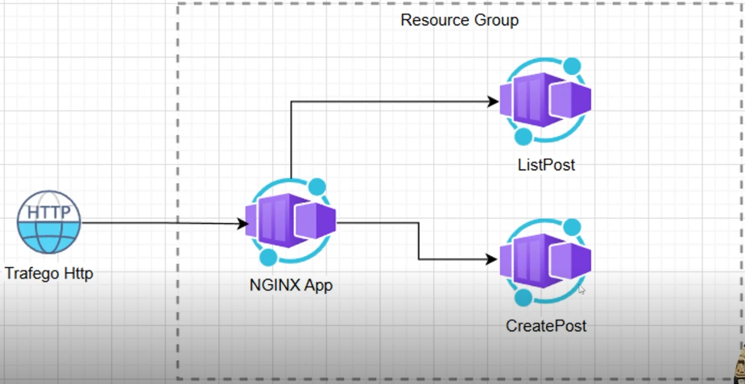
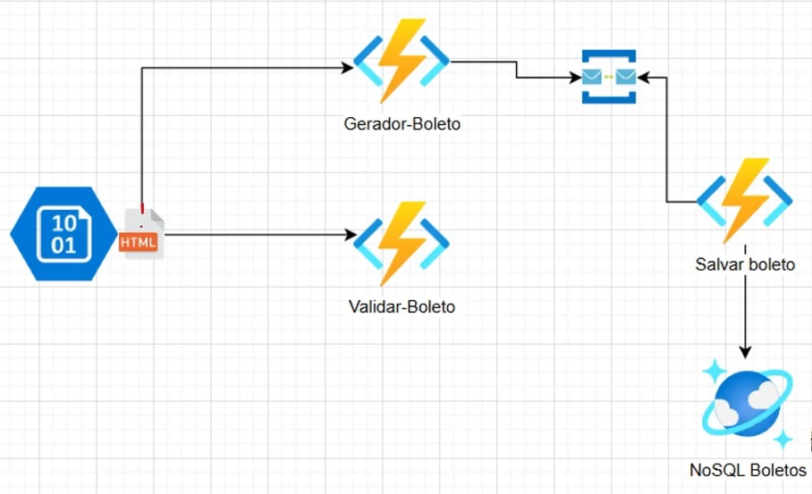

## Product (lab01)
Product registration project for the Microsoft Azure Cloud Native course on the Digital Innovation One learning platform with Python.

Description:
Create a basic Product registration and push to Azure Cloud using Azure storage.

---

## Blog (lab03)
Blog project for the Microsoft Azure Cloud Native course of the Digital Innovation One learning platform with with HTML, CSS (Bootstrap), Javascript.

Azura Container Architecture:

Description:
Create a basic blog and push to Azure Cloud using Container.

---

## Ticket (lab05)
Ticket (payment slip) generator project for the Microsoft Azure Cloud Native course of the Digital Innovation One learning platform with C#.

Azura Container Architecture:

Description:
Basic Payment slip generator with barcode and push to Azure Cloud using Azure Function, Azure Service bus developed with C# (dependencies: Newtonsoft.json, Azure.Messaging.ServiceBus, Barcodelib) triggered by Http request.

---

## Copilot (lab06)
Copilot code generator project for the Microsoft Azure Cloud Native course of the Digital Innovation One learning platform with natural language

Description:
Generation of code using Copilot with natural language using feature such as (@workspace / new, @workspace / fix, and Copilot Agent).